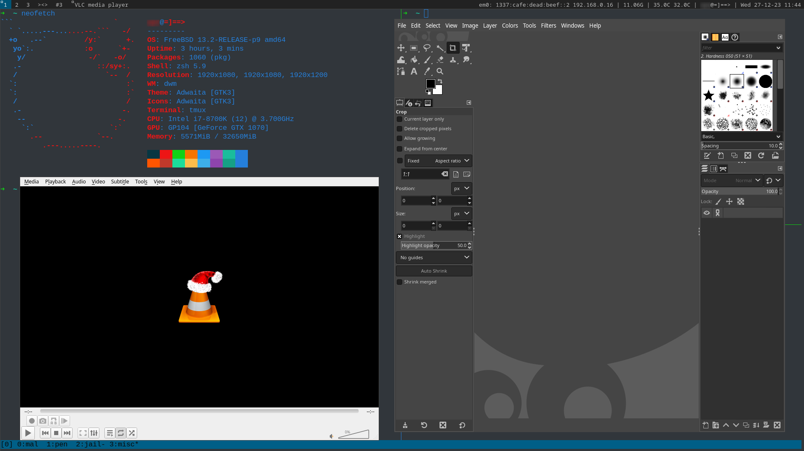

# EDWM

Enhanced Dynamic Window Manager.

Added functionalities based on the original [Dynamic Window Manager (DWM)](https://dwm.suckless.org/) to make things much easier. Thanks suckless guys, a lot!

I've been using `DWM` for over 4 years, simple things keeps your mind focused on what you're doing. Since the publish of 6.4, I arranged another upgrade and added some other functionalities and features that I think will make life beautiful. I'll list them in the following sections.

I don't really use the tiling system much becuase of the existence of tmux. But I've come up with that the `tile` system introduced by `DWM` can be very much used to implement a `task view` (I call it `Deep View`) functionality. During the years of using DWM, I found myself seldomly swithing beyond three (3) tags, because you know, switching tags is a kind of overhead, I might as well have multiple windows open in one tag, and have a way to find each window quickly is enough. And if I do need to swith tags, only because I have too many windows open in one..., that rarely happens because I have multiple monitors connected.

That being said, the goal is to:

* Easily find a window if there're many opened in the same tag;
* Easily maximize a window without using the `Monocle` feature;
* Have indicators of how many windows are opened in the current tag;
* etc...

That being said, hopefully you will find the following enhancements handy.

# Features

## Deep View (Task View)

All windows defaults to open floating, so the tile system won't kick in to resize the unfocus windows. Assuming you have multiple windows opened in one tag, to find a particular window easily, go into `Deep View` (default key combination is `Mod + XK_d`), this will clear all the floating bits of windows and let the tile system arrange them on the screen, so you can choose whichever window you want to interact with by simply click on it. Easy! And to exit `Deep View`, just press the same key combination again, everything restores to their original size and position, nothing happend.

Note that in EDWM the default layout has been changed to floating, the layout symbol being `><>`, I like this little fish.

Note that when in `Deep View` mode, the layout symbol is `[D]`, so that you know where you're.

Note that at present you cannot click on the window that's already been focused to exit `Deep View`, I'll figure it out later, but I don't think it's going to matter much, becuase you just press `Mod + XK_d` again and everyhing's good.

## Maximize a Window

Being able to maximize a window is crucial, the original `Monocle` mode is not that ideal. So now, press `Mod + XK_f` to maximize a window, and `Mod + XK_f` again to bring the window back to its original size and position.

Note that the maximized window is doesn't cover the status bar, to perform an actual full screen, hit `Fn + F11` if the window supports it.

## Indocator of Number of Windows Opened

One thing about floating layout is that if some windows are hiding behind the current one, it's hard to tell how many windows are there in current tag. So I added this indicator to show me the number of windows opened in a particular tag, so I know there're multiple windows, then I can use `Deep View` to find the one I want.

You don't have to note anything, it's just a number :D

## Snap Two Windows Side by Side With in One Shot

Want to easily view two windows side by side on a screen, you got it now! `Mod + XK_e` now to snap two windows side by side, each take half of the screen. Press the key combinations again to restore each window to its original position and size. Handy!

## Snap a Window To Left/Right Edge of the Screen Via Keyboard Shortcut

Want to snap one specific window to either side (left/right) of the screen? Press `Mod + Xk_j` to snap to the left, and `Mod + XK_k` to snap to the right. The window will take full height and half width of the screen. To restore the size, drag it back with mouse or press the key combination again.

## Snap a Window To Left/Right Edge of the Screen Via Mouse Dragging

This is to mimic the behavior on windows, which I is a must have. Now, you just have to darag the window out of the left or right edge of the screen (currently at 20px mark), then the window will be snapped/docked to either side, taking half of the screen width. Multiple dipslay is supported, you can do this on either one of your connected displays. And to restore the window to its original size, just drag it away from the edge!

## Swap Position of Snapped Windows Left and Right

When in snap mode, press `Mod + XK_s` to swap the windows from left to right as needed.

## Increase and/or Decrease the Size When Windows Are Snapped

When two windows are snapped side by side (both snap mode and dragged to edge), you can use `Mod + Shift + XK_j` to increase the width of one window, and the other window's width will decrease automatically; and use `Mod + Shift + XK_k` to do the opposite.

## Anchor a Window as Always on Top

This is supplementary for the snap side by side feature. Sometimes you want to look at the one window and do some stuff in another, like taking some notes, and you don't want the other window to be hidden when you are searching or doing whatever in the original window. Now, press `Mod + XK_r` to anchor one of the window as always on top (there will be another little square down the title of the window), so you won't lose it when doing the things you want. As always, press the key combination again to revert.

## Switch Between Two Windows Instantly

I remember the default behavior of DWM when pressing `Mod + XK_Tab` is to cycle through all clients until you found the one you want. This is inconvenient if you want the one in the middle of the client stack. I want a feature where you can just quickly switch between two recently focused windows. Now, just press `Mod + XK_Tab` to do that, and press `Mod + XK_w` to cycle through all clients for the default behavior.

## Stay Low

Sometimes you want to quickly check some part of the main area screen for information but other windows are blocking the view, just press `Mod + XK_v` to shrink the window to lower right corner, after you're done, focuse on the shrunk window and press the key combination again to bring it back. Note that you'll lose focus on the window you want to shrink immediately after the operation.

# Community Patches

I've applied some patches so that:

* The status bar will be on every monitor connected;

# Installation

Rename `sample.config.mk.xxx` to `config.mk` according to the system you're on.

Install dependency: `sudo apt install libxft-dev` (linux).

Then `make && sudo make install clean` to compile and install.

That's it! Enjoy!

# Default Key Combinations and Functionalities

Listed below are the changed key combinations different from the original implementation.

|Key Comb|Function|
|:------:|:------:|
|Mod + XK_q|Spawn dmenu|
|Mod + XK_c|Screenshot, use whatever program you want in config.def.h|
|Mod + XK_a|Spawn xterm (refer to dwm.c, spawnxterm function)|
|Mod + Shift + Return|Spawn whatever is in termcmd in config.def.h|
|Mod + XK_r|Mark a window always on top|
|Mod + XK_v|Minimize a window to lower right corner of screen (maybe buggy), again to restore|
|Mod + XK_w|Cycle through windows (clockwise)|
|Mod + XK_Tab|Switch between two recent windows|
|Mod + XK_e|Snap two most recent windows side by side on screen|
|Mod + XK_s|Swap the position of two snapped windows left to right|
|Mod + XK_j|Sanp a focused window to left of the screen|
|Mod + XK_k|Sanp a focused window to right of the screen|
|Mod + Shift + XK_j|Increase snapped window width, and decrease the other one's|
|Mod + Shift + XK_k|Decrease snapped window width, and incease the other one's|
|Mod + Shift + XK_c|Kill client|
|Mod + XK_d|Toggle deep view|
|Mod + XK_f|Toggle maximize a window|
|Mod + XK_bracketright|Quit DWM|
|Middle Mouse Button|Move window|
|Mod + Right Mouse Button|Resize window|

For a complete key combination, refer to `config.def.h`, feel free to modify.

# TODO
- [x] Restack the windows picked up from deep view mode so the cycle through functionality can do things right;
- [X] Display two windows half half on a screen;
- [X] Drag a window to snap to left/right side of the screen;
- [X] Incease/decrease snapped window width;

# Known Issues

* If sometimes snap function and swap function doesn't work, press the key combination twice may solve the problem. Some variables still needs a bit of tweaking;

* Check is "[S]" symbol is on status bar. If only one window is opened, press `Mod + XK_e` will exit snap mode and everything should be fine;

* The window shrunk to bottom right corner with `Mod + XK_v` feature could be buggy, sometimes cannot restore its size and position;

* If you found dragging a window to the left or right edge doesn't snap the window to the edge, check if you're in snap mode (see if "[S]" is displayed on the task bar), if so, press `Mod + XK_e` to exit snap mode fist;

* Use of fullscreen mode, snap mode, and dragging and snap together will result in window cannot restore to its original size, may give that a look in the future but not urgent;

# Bugs

For any bugs found, open an issue and I'll have it fixed if time permits.

# Credits

* [Suckless DWM](https://dwm.suckless.org/)
